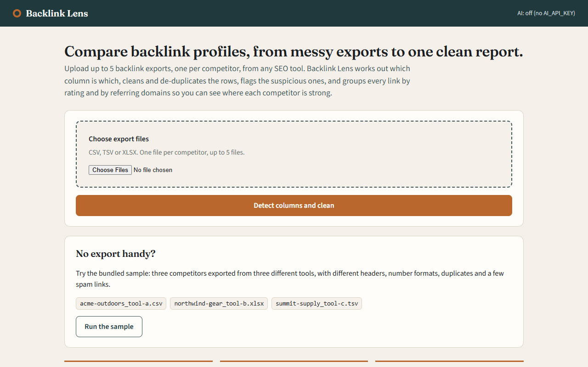
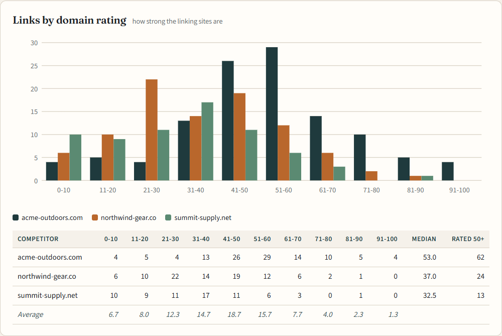
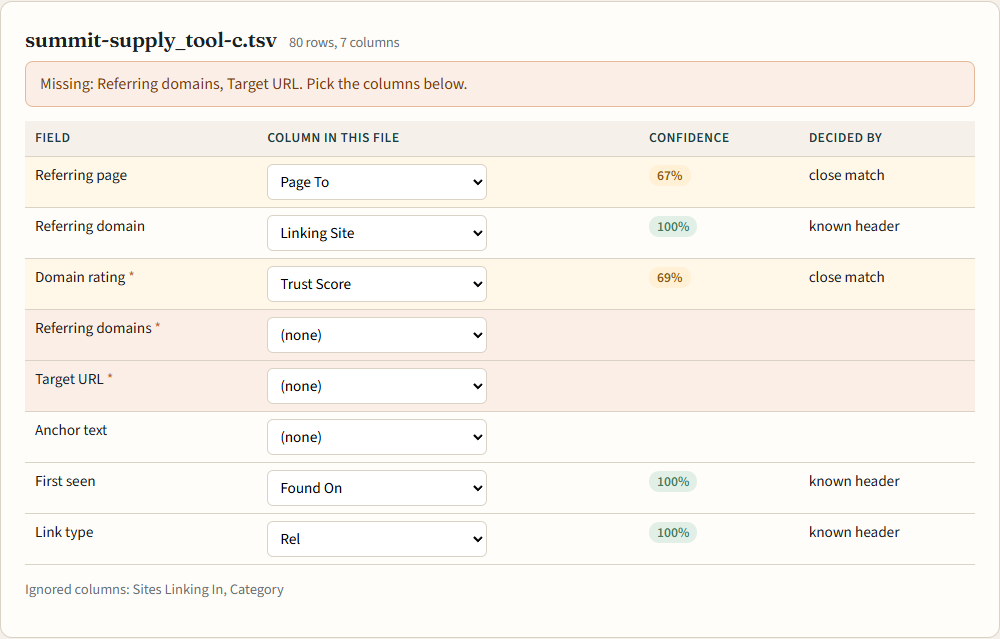
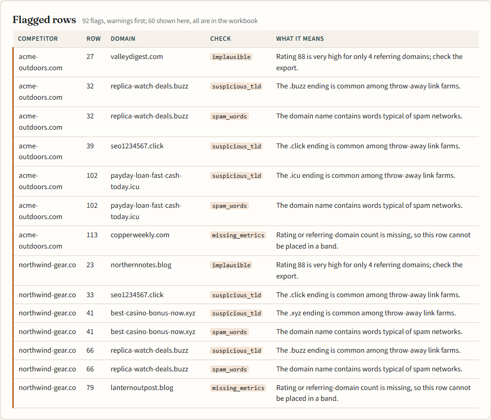
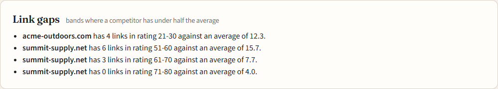
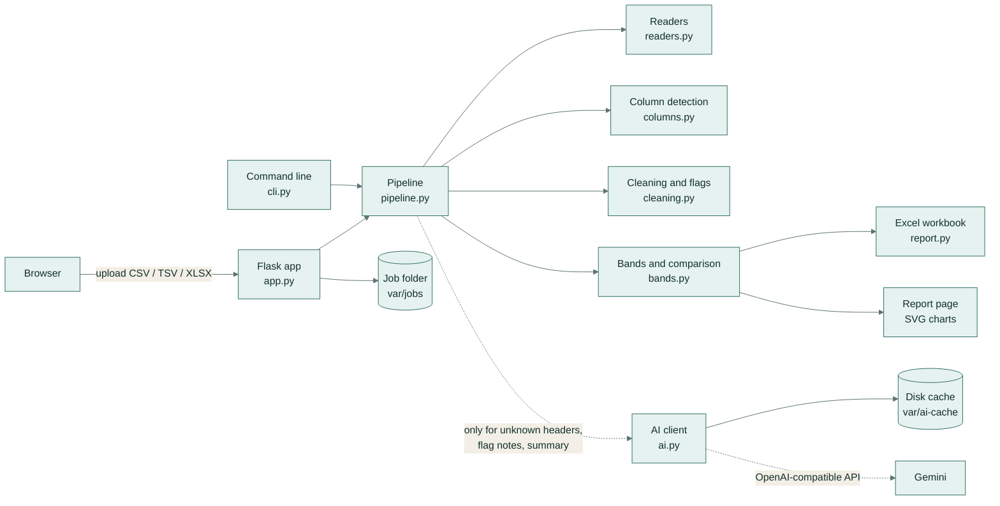
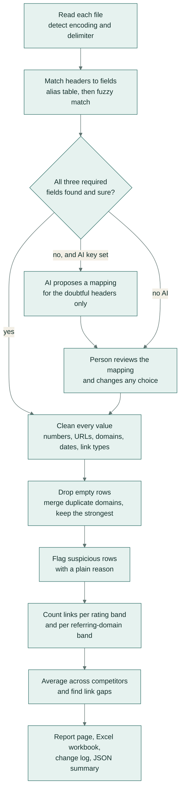
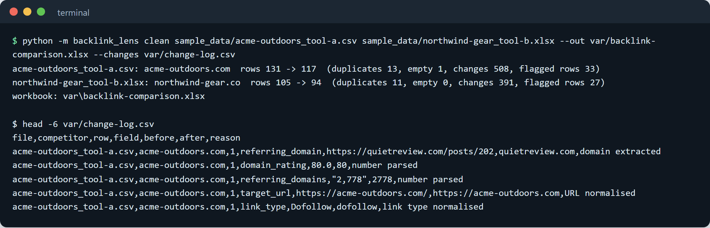
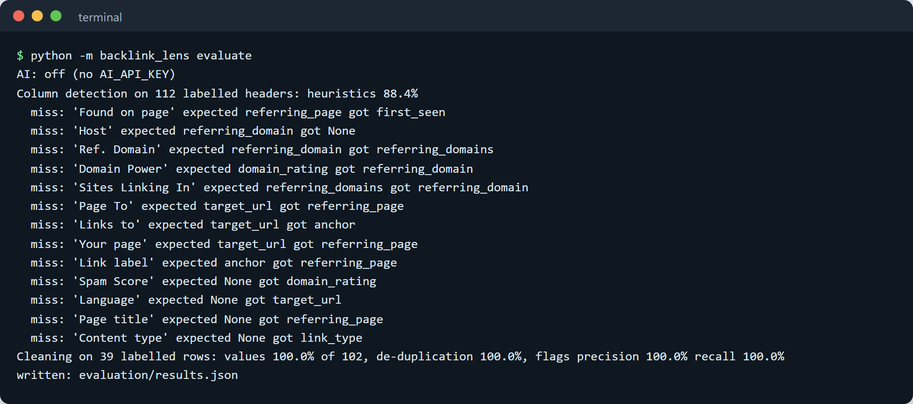
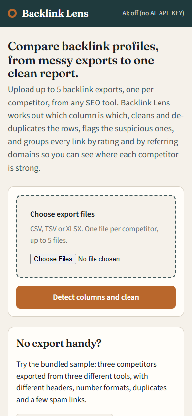

# Backlink Lens

Turn messy backlink exports from different SEO tools into one clean, side-by-side comparison of your competitors,
with every change written down and the doubtful links pointed out.



*The demo above: three competitors' link lists, each from a different tool, are cleaned and compared in under a
minute. One file uses unusual column names, so the person picks two columns from a drop-down before the report is
built.*

## What it does

Websites earn trust with search engines partly through other sites linking to them. SEO tools let you download the
list of sites linking to a competitor, but every tool names its columns differently and fills them with
inconsistent numbers, duplicates and junk. Backlink Lens reads those downloads, cleans them, and shows how strong
each competitor's links are, side by side, with a ready-to-share Excel file.

## A real-life example

Dana is the marketing lead at Summit Supply, a small outdoor-gear shop (an invented business). Each quarter she
compares Summit's links with two rivals, Acme Outdoors and Northwind Gear.

- **Before:** her three downloads come from three different tools. One says "DR", one says "DA", one says
  "Trust Score". One writes "1,200", another "1.2k". The same linking site appears several times, and a few spam
  sites are mixed in. Lining it all up by hand in a spreadsheet took her most of an afternoon, and she was never
  sure she had caught every duplicate.
- **With Backlink Lens:** she drops the three files on the page. The tool recognises most columns on its own and
  asks her about the two it could not place. She clicks **Build the comparison**.
- **After:** a few minutes later she has the comparison. Out of 316 rows, 33 duplicates were merged and 77 rows
  were flagged with a plain reason, such as "the .xyz ending is common among throw-away link farms". She can see at
  a glance that Summit has **no links at all from sites rated 71–80**, while the others average 4. She downloads one
  Excel file with the comparison, the cleaned lists, the flags and a log of every value that was changed, and
  forwards it to her agency.



*Each bar counts one competitor's links from sites in a strength range (0–10 is weakest, 91–100 strongest). Acme
Outdoors, the dark bars, has far more links from strong sites. That gap is what Dana wants to close.*

## How you would use it

1. Start the app (one command, see [Setup](#setup)) and open http://127.0.0.1:5000 in your browser.
2. Click **Choose export files** and pick up to five downloads, one per competitor. CSV, TSV and Excel files all
   work. No files yet? Click **Run the sample** instead.
3. Check the column page. Green means the tool is sure, yellow means it guessed, and red means it needs you. Fix
   anything red with the drop-down.
4. Click **Build the comparison** and read the result: what was cleaned, the strength charts, the link gaps and the
   flagged rows.
5. Click **Download Excel workbook** for the full report, or **Change log (CSV)** for every edit the tool made.



*This file calls its columns "Sites Linking In" and "Page To", which the tool cannot place on its own. The missing
ones are marked in red. With an AI key set, the AI suggests them first; you always have the final say.*



*Every flag comes with a sentence anyone can act on. Warnings come first; informational notes, such as "this link
is marked nofollow", follow and are all kept in the workbook.*



*Link gaps tell you where to aim: ranges where one competitor is clearly behind the others.*

---

## Architecture

The tool is a small Flask web app (Flask is a Python web framework) with a command line next to it. Both run the
same pipeline. The optional AI step talks to any OpenAI-compatible endpoint, Gemini by default, and is only ever
consulted for what the rules could not settle.



## How it works



1. **Read.** Each upload is read as CSV, TSV or the first sheet of an Excel file. The encoding (UTF-8, UTF-16 or
   Windows-1252) and the delimiter (comma, semicolon, tab or pipe) are detected. The first non-empty row is the
   header.
2. **Detect columns.** Every header is normalised ("Domain Rating (DR)" becomes "domain rating dr") and compared
   with an alias table of the names real exports use: "DR", "DA", "Domain Authority", "Linking Root Domains",
   "Ref. Domains" and so on. An exact alias scores 100%, a header that contains an alias scores 85–95%, and anything
   else gets a fuzzy string-similarity score. Each field takes its best header, and each header is used once.
   There are eight fields; three are required: the **domain rating** (how strong the linking site is, 0–100), the
   **referring domains** (how many sites link to that site) and the **target URL** (the competitor page being
   linked to).
3. **Ask the AI, when it helps.** If headers are unmapped or below 85% confidence and `AI_API_KEY` is set, the
   model sees only those headers plus three sample rows. It answers in JSON, and any header it invents is
   rejected.
4. **Review.** The column page shows every choice, its confidence and who decided it (known header, close match,
   AI suggestion or you). Only the choices you change are stored, so "decided by" stays truthful.
5. **Clean.** Numbers such as "1,234", "1.2k", "45%", "n/a" and "—" are parsed, and ratings are clamped to 0–100.
   URLs lose `www.`, fragments, tracking parameters (`utm_*`, `gclid`, `fbclid`) and trailing slashes. Domains are
   taken from the page URL when there is no domain column. Dates in ten common formats become `YYYY-MM-DD`. Link
   types become `dofollow`, `nofollow`, `ugc` or `sponsored`. Every change is logged with its row, the value
   before and after, and the reason.
6. **De-duplicate.** One row per referring domain is kept, the one with the highest rating, and each dropped
   duplicate is logged with the row it duplicated.
7. **Flag.** Rule-based checks, each with a sentence a non-expert can act on: missing metrics, metrics that
   contradict each other (rating 70+ with under 10 referring domains, or over 5,000 referring domains with a
   rating under 10), link-farm endings (`.xyz`, `.top`, `.click`, ...), spam words, auto-generated-looking names,
   links from the competitor's own site, and nofollow, UGC or sponsored links.
8. **Compare.** Links are counted in ten rating bands (0–10, 11–20, ..., 91–100) and eleven referring-domain bands
   (1–100, ..., 901–1000, 1001+), with the average across competitors. The median rating and the number of links
   rated 50+ are shown per competitor. A *link gap* is a rating band where a competitor has less than half the
   average, when that average is at least 3.
9. **Explain.** With a key, the model also writes a one-sentence note for up to 12 flagged domains and a
   120-word summary of the comparison. Both are optional; the page works the same without them.

**The AI client** (`backlink_lens/ai.py`) caches every answer on disk, keyed by model, prompt and settings, so a
repeat run makes no calls. It spaces live calls at least 2.5 seconds apart and treats any error, such as no key, a
timeout or a quota limit, as "no AI help this time", so the rules-only path always completes.

**The workbook** has a *Summary* sheet (both band tables with averages, per-competitor statistics and the AI
summary when present), one cleaned sheet per competitor with its flags, a *Flags* sheet, a *Change log* sheet and a
*Column mapping* sheet that records how each column was chosen.



## Evaluation

All evaluation data is invented and hand-labelled. It lives in `evaluation/data/`, and
`python -m backlink_lens evaluate` reproduces the numbers and writes them to `evaluation/results.json`.

| What is measured | Labelled set | Result |
| --- | --- | --- |
| Column detection, rules only | 112 headers seen in backlink exports, 18 of them columns that should be ignored | **88.4%** mapped to the right field |
| Cleaned values (domain, rating, referring domains) | 102 values in 39 messy rows (`messy.csv`) | **100%** |
| De-duplication: right rows kept or dropped | 39 rows, 5 duplicates and 1 blank row | **100%** |
| Flags: precision / recall | 29 expected flags on those rows | **100% / 100%** |

- **How it is scored.** A header counts as correct only when it maps to the labelled field. For the 18 "ignore"
  headers, correct means left unmapped. Cleaning is scored value by value against `messy_labels.csv`. Flags are
  scored as (row, check) pairs.
- **What the rules miss.** All 13 misses are listed in `results.json`. Examples: "Page To" and "Your page" are
  read as the linking page rather than the target, "Content type" is taken for a link type, and "Spam Score" is
  taken for a rating.
- **Where the AI step comes in.** These are exactly the doubtful or unmapped headers the AI step is asked about,
  and the column page shows them in yellow or red for review. With `AI_API_KEY` set, the same command also reports
  a "heuristics + AI" accuracy, counted only when the model actually answered.
- **Scope.** The cleaning set is small and was written alongside the rules, so it checks that each rule does what
  it says. It is not a claim about every export format.



## Tech stack

- **Python 3.11+**
- **Flask**: web app, Jinja templates and inline SVG charts, with no JavaScript.
- **openpyxl**: reads uploaded Excel files and writes the report workbook.
- **openai** client against Gemini's OpenAI-compatible endpoint (`gemini-flash-lite-latest`); this is optional.
- **pytest**, **ruff** (lint and format) and **mypy** (strict type checking), run in GitHub Actions.
- The standard library does the rest: `csv`, `difflib` for fuzzy matching and `urllib.parse`. pandas is not
  needed.

## Setup

```bash
make setup     # creates .venv and installs requirements-dev.txt
make demo      # starts http://127.0.0.1:5000/ and prints a link to the sample, already loaded
```

Without `make`, for example on Windows PowerShell:

```bash
python -m venv .venv
.venv\Scripts\pip install -r requirements-dev.txt      # macOS/Linux: .venv/bin/pip
.venv\Scripts\python -m backlink_lens demo
```

## Configuration

All settings are optional environment variables. The app runs fully without any of them.

| Variable | Purpose | Default |
| --- | --- | --- |
| `AI_API_KEY` | Key for the OpenAI-compatible endpoint; turns on AI column mapping, flag notes and the summary | unset (AI off) |
| `AI_BASE_URL` | Endpoint base URL | Gemini's OpenAI-compatible URL |
| `AI_MODEL` | Model name | `gemini-flash-lite-latest` |
| `AI_CACHE_DIR` | Where AI answers are cached | `var/ai-cache` |
| `BACKLINK_LENS_VAR` | Folder for uploaded jobs | `var` |
| `SECRET_KEY` | Flask session key for flash messages | random per start |

Pass the key at runtime only, for example `AI_API_KEY="$GEMINI_API_KEY" make demo`. Never write it to a file in
the repository.

## Usage

```bash
python -m backlink_lens serve --port 5000            # web app
python -m backlink_lens demo                         # web app with the sample job ready
python -m backlink_lens clean a.csv b.xlsx c.tsv --out comparison.xlsx --changes change-log.csv
python -m backlink_lens clean a.csv --json --no-ai   # JSON summary, never call a model
python -m backlink_lens evaluate                     # labelled evaluation
python scripts/make_samples.py                       # regenerate sample_data/ (deterministic)
```

The web app also serves `/jobs/<id>/summary.json` (the comparison as JSON), `/jobs/<id>/report.xlsx`,
`/jobs/<id>/changes.csv` and `/healthz`.



## Project structure

```
backlink_lens/
  readers.py      CSV / TSV / XLSX reading, encoding and delimiter detection
  columns.py      field definitions, alias table, header matching, user overrides
  cleaning.py     value normalisers, cleaning pass, de-duplication, flag rules, change log
  bands.py        rating and referring-domain bands, profiles, comparison, link gaps
  chart.py        grouped bar chart geometry for the SVG charts
  report.py       Excel workbook and change-log CSV
  ai.py           cached, rate-limited OpenAI-compatible client and the three AI tasks
  pipeline.py     read -> map -> clean -> compare -> explain
  app.py          Flask routes: upload, sample, columns, report, downloads
  cli.py          serve, demo, clean, evaluate
  templates/      Jinja pages
  static/         stylesheet
evaluation/
  data/           labelled headers, messy rows and their expected results (all invented)
  evaluate.py     scoring script
  results.json    latest numbers
sample_data/      three invented competitors, three export formats
scripts/          sample generator
tests/            pytest suite
docs/             demo GIF and screenshots
```

## Tests

```bash
make test      # pytest: 37 tests
make lint      # ruff check, ruff format --check, mypy (strict)
make eval      # evaluation
```

The tests cover:

- the header matching, the overrides and every normaliser;
- de-duplication, the change log and each flag rule;
- the band edges, the averages and the gap detection;
- the workbook sheets and the sheet-name rules;
- chart geometry;
- the web flow end to end: upload, mapping fix, report and every download;
- the AI layer, through a fake transport: caching, call spacing, error fallback, JSON mapping proposals and
  invented-header rejection.

CI (`.github/workflows/ci.yml`) runs the same lint, type check, tests and evaluation with `AI_API_KEY` empty, so it
never calls a model. It also checks that the sample files match their generator.

## Licence

MIT. See [LICENSE](LICENSE).
